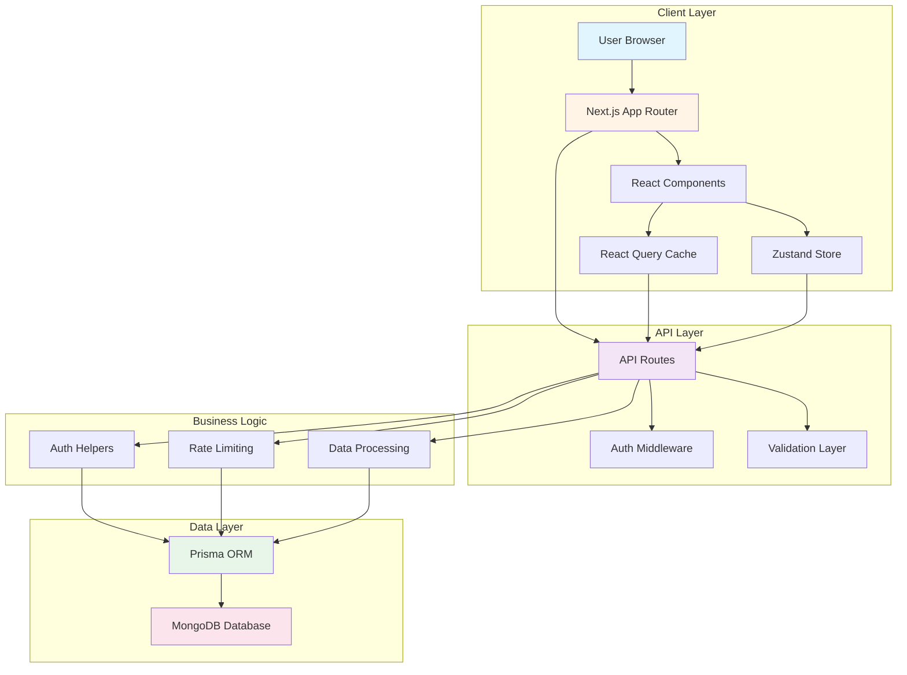
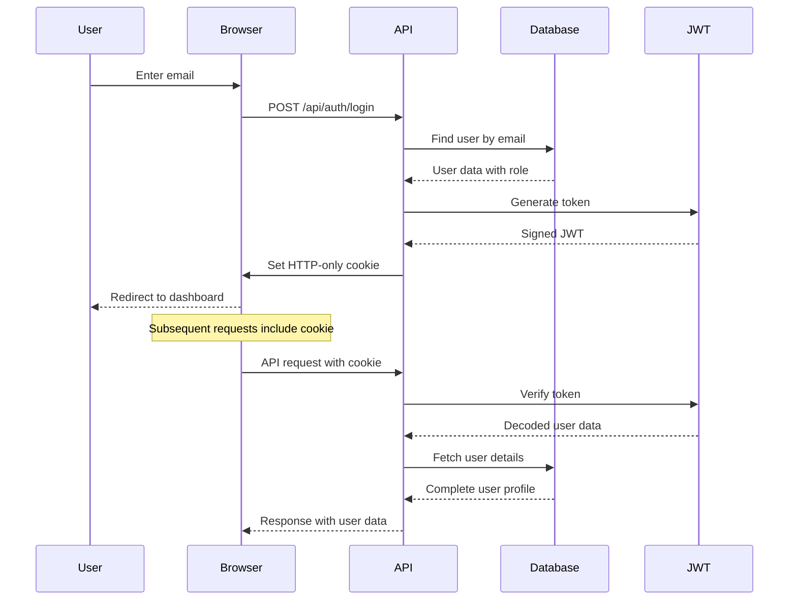
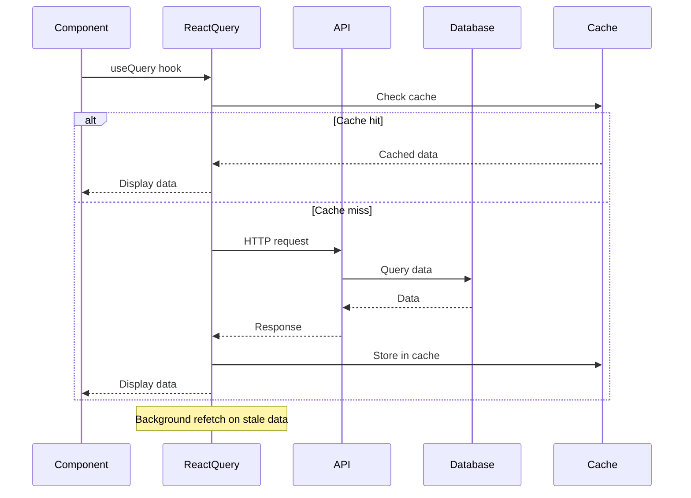
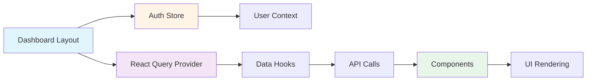

# System Architecture Documentation

## Table of Contents
1. [System Overview](#system-overview)
2. [Technology Stack](#technology-stack)
3. [Architecture Diagram](#architecture-diagram)
4. [Key Architectural Decisions](#key-architectural-decisions)
5. [Project Structure](#project-structure)
6. [Data Flow](#data-flow)
7. [Security Architecture](#security-architecture)
8. [Performance Considerations](#performance-considerations)

## System Overview

Freedom City Tech Center Management System is a comprehensive academic management platform built with Next.js 16, MongoDB, and Prisma ORM. The system serves multiple user roles (Admin, Teacher, Student) with role-based access control, academic tracking, cleaning management, and administrative oversight capabilities.

### Core Features
- **Authentication & Authorization**: Email-based login with JWT tokens and role-based access control
- **Dashboard System**: Role-specific dashboards for Admin, Teacher, and Student users
- **Academic Management**: Course enrollment, grade tracking, GPA calculation, tuition management
- **Cleaning Management**: Weekly cleaning schedules, student registration, attendance tracking
- **Admin Panel**: User management, role assignment, system reporting, oversight capabilities
- **Real-time Features**: Live data updates with React Query caching

## Technology Stack

### Frontend
- **Framework**: Next.js 16 (App Router)
- **Language**: TypeScript 5.9.3
- **UI Library**: React 19, TailwindCSS 3.4.17
- **State Management**: Zustand 5.0.14
- **Data Fetching**: TanStack React Query 5.0.0
- **Animations**: Framer Motion 12.40.0
- **Charts**: Recharts 3.8.1
- **Icons**: Lucide React 1.17.0
- **Forms**: Zod 4.4.3 (validation)

### Backend
- **Runtime**: Next.js API Routes (Edge & Node.js)
- **Database**: MongoDB
- **ORM**: Prisma 5.22.0
- **Authentication**: JWT (jsonwebtoken 9.0.2, jose 6.2.3)
- **Password Hashing**: bcryptjs 2.4.3
- **HTTP Client**: Axios 1.17.0

### Development Tools
- **Package Manager**: npm
- **Build Tool**: Turbopack (Next.js 16)
- **Linting**: ESLint 9
- **Code Analysis**: Knip 6.16.1
- **Type Checking**: TypeScript strict mode

## Architecture Diagram



## Key Architectural Decisions

### 1. MongoDB with Prisma ORM
**Rationale**: 
- Flexible schema for evolving academic requirements
- Document-based storage fits student/teacher profiles well
- Prisma provides type-safe database access
- Excellent for nested data structures (grades, courses, cleaning assignments)

**Trade-offs**: 
- Less strict schema than SQL databases
- Requires careful index management for performance

### 2. JWT Token Authentication with Cookies
**Rationale**:
- Stateless authentication suitable for distributed deployment
- HTTP-only cookies prevent XSS attacks
- Token includes user role for efficient authorization
- Edge-compatible JWT generation for performance

**Implementation**:
- Tokens stored in HTTP-only cookies (7-day expiry)
- Role information embedded in token for RBAC
- Middleware sets user context headers for API routes

### 3. React Query for Server State
**Rationale**:
- Automatic caching and background refetching
- Optimistic updates for better UX
- Type-safe data fetching with TypeScript
- DevTools for debugging data flow

**Usage**:
- Query key hierarchy for cache management
- Stale time configuration per data type
- Automatic cache invalidation on mutations

### 4. Zustand for Client State
**Rationale**:
- Lightweight alternative to Redux
- Simple API for auth state management
- No provider setup required
- Excellent TypeScript support

**Usage**:
- Authentication state (user, isAuthenticated, loading)
- Login/logout actions
- User data fetching and caching

### 5. App Router with Server Components
**Rationale**:
- Improved performance with server-side rendering
- Streaming capabilities for faster page loads
- Built-in routing and layouts
- Better SEO with server rendering

**Implementation**:
- Server components for data fetching
- Client components for interactivity
- Nested layouts for dashboard structure
- Route groups for organization

### 6. Role-Based Access Control (RBAC)
**Rationale**:
- Clear separation of concerns between user types
- Scalable permission system
- Database-driven role assignment
- Helper functions for authorization checks

**Roles**:
- **Admin**: Full system access, user management
- **Teacher**: Student management, grade assignment
- **Student**: View own data, course enrollment

## Project Structure

```
my-app/
├── app/                          # Next.js App Router
│   ├── api/                      # API Routes
│   │   ├── admin/               # Admin endpoints
│   │   ├── auth/                # Authentication endpoints
│   │   ├── cleaning/            # Cleaning management
│   │   ├── contact/             # Contact form
│   │   ├── overview/            # Dashboard overview
│   │   ├── student/             # Student endpoints
│   │   └── teacher/             # Teacher endpoints
│   ├── dashboard/               # Dashboard layouts
│   │   ├── admin/              # Admin dashboard
│   │   ├── overview/           # Overview dashboard
│   │   ├── student/            # Student dashboard
│   │   └── teachers/           # Teacher dashboard
│   ├── layout.tsx              # Root layout
│   ├── page.tsx                # Landing page
│   ├── login/                  # Login page
│   └── register/               # Registration page
├── components/                  # React Components
│   ├── admin/                  # Admin-specific components
│   ├── cleaning/               # Cleaning system components
│   ├── overview/               # Dashboard overview components
│   ├── shared/                 # Shared/reusable components
│   ├── student/                # Student-specific components
│   ├── teacher/                # Teacher-specific components
│   └── ui/                     # UI component library
├── hooks/                      # Custom React Hooks
│   └── queries/                # React Query hooks
├── lib/                        # Utility libraries
│   ├── api/                    # API client functions
│   ├── validations/            # Zod validation schemas
│   ├── auth-helper.ts          # Auth helper functions
│   ├── axios.ts                # Axios configuration
│   ├── constants.ts            # Application constants
│   ├── gpa-calculator.ts       # GPA calculation utilities
│   ├── prisma.ts               # Prisma client
│   ├── rateLimit.ts            # Rate limiting
│   └── utils.ts                # General utilities
├── stores/                     # Zustand stores
│   └── authStore.ts            # Authentication state
├── prisma/                     # Prisma ORM
│   └── schema.prisma           # Database schema
├── public/                     # Static assets
│   ├── sw.js                   # Service worker
│   └── manifest.json           # PWA manifest
├── package.json                # Dependencies
├── next.config.js              # Next.js configuration
├── tsconfig.json               # TypeScript configuration
└── knip.json                  # Code analysis configuration
```

## Data Flow

### Authentication Flow


### Data Fetching Flow


### Dashboard Data Flow


## Security Architecture

### Authentication Layers
1. **Client-Side**: Zustand auth store manages authentication state
2. **API Layer**: JWT verification on protected routes
3. **Middleware**: Optional middleware for route protection
4. **Database**: Role-based access control at data level

### Security Measures
- **Password Hashing**: bcryptjs with salt rounds
- **JWT Security**: HTTP-only cookies, 7-day expiry
- **Rate Limiting**: 5 requests per minute per IP/email
- **Input Validation**: Zod schemas on all API endpoints
- **SQL Injection Prevention**: Prisma ORM parameterized queries
- **XSS Prevention**: React's built-in escaping, HTTP-only cookies
- **CSRF Protection**: SameSite cookie policy

### Authorization Pattern
```typescript
// Helper functions for authorization
export async function requireAuth(request: NextRequest)
export async function requireRole(request: NextRequest, requiredRoles: string[])
export function hasRole(user: any, requiredRoles: string[]): boolean
```

## Performance Considerations

### Frontend Optimization
- **Code Splitting**: Next.js automatic code splitting
- **Image Optimization**: Next.js Image component with WebP/AVIF
- **Bundle Optimization**: Turbopack with package import optimization
- **CSS Optimization**: TailwindCSS with purge
- **Caching Strategy**: React Query with stale-time configuration

### Backend Optimization
- **Database Indexing**: Strategic indexes on frequently queried fields
- **Connection Pooling**: Prisma connection management
- **Edge Runtime**: JWT generation on edge for faster responses
- **Compression**: Gzip compression enabled
- **Rate Limiting**: Prevents API abuse

### Monitoring & Debugging
- **Axios Interceptors**: Request/response logging
- **React Query DevTools**: Cache inspection
- **Console Logging**: Structured logging for debugging
- **Error Boundaries**: Graceful error handling

## Scalability Considerations

### Horizontal Scaling
- Stateless JWT authentication enables multiple instances
- MongoDB supports horizontal scaling with sharding
- API routes can be deployed on edge functions

### Vertical Scaling
- Database connection pooling
- Efficient caching strategies
- Optimized database queries with indexes

### Future Enhancements
- Redis for distributed caching
- Message queue for background jobs
- CDN for static asset delivery
- Database read replicas for read-heavy operations
