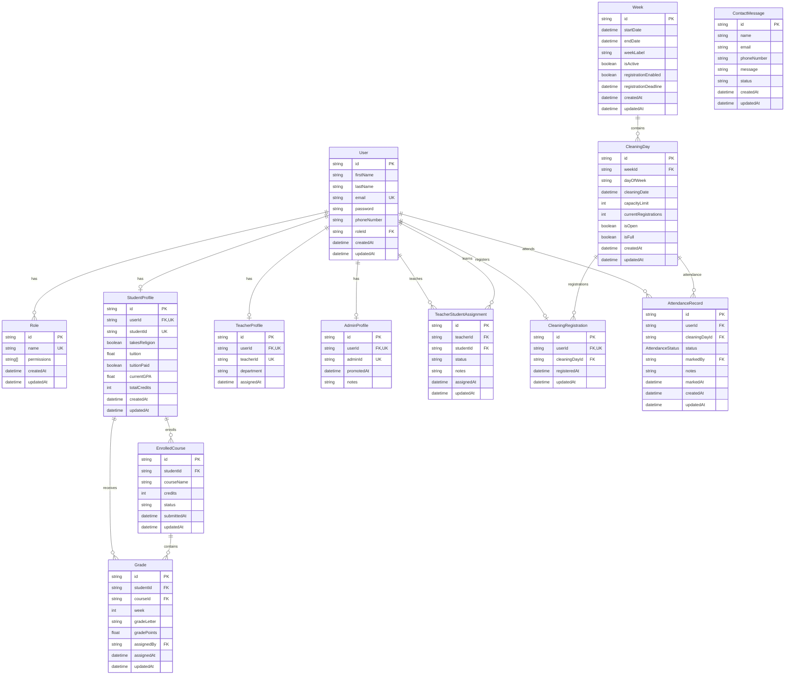

# Database Schema Documentation

## Table of Contents
1. [Overview](#overview)
2. [Entity Relationship Diagram](#entity-relationship-diagram)
3. [Core Models](#core-models)
4. [Academic Models](#academic-models)
5. [Cleaning Management Models](#cleaning-management-models)
6. [Legacy Models](#legacy-models)
7. [Indexes and Performance](#indexes-and-performance)
8. [Data Relationships](#data-relationships)
9. [Migration Strategy](#migration-strategy)

## Overview

The database uses MongoDB with Prisma ORM as the data layer. The schema is designed to support a multi-role academic management system with features for authentication, academic tracking, cleaning management, and administrative oversight.

### Database Configuration
- **Provider**: MongoDB
- **ORM**: Prisma 5.22.0
- **Connection**: Environment variable `DATABASE_URL`
- **Client Generation**: Automatic on postinstall

## Entity Relationship Diagram



## Core Models

### User
**Purpose**: Central user entity for all system users (students, teachers, admins)

**Fields**:
- `id` (ObjectId): Primary key
- `firstName` (String): User's first name
- `lastName` (String): User's last name
- `email` (String, unique): User's email address (login identifier)
- `password` (String): Hashed password (bcrypt)
- `phoneNumber` (String, optional): Contact phone number
- `roleId` (ObjectId, optional): Foreign key to Role
- `createdAt` (DateTime): Account creation timestamp
- `updatedAt` (DateTime): Last update timestamp

**Relationships**:
- One-to-one with StudentProfile (if student)
- One-to-one with TeacherProfile (if teacher)
- One-to-one with AdminProfile (if admin)
- Many-to-many with TeacherStudentAssignment (as teacher)
- Many-to-many with TeacherStudentAssignment (as student)
- One-to-one with CleaningRegistration
- One-to-many with AttendanceRecord

### Role
**Purpose**: Role-based access control (RBAC)

**Fields**:
- `id` (ObjectId): Primary key
- `name` (String, unique): Role name ("admin", "teacher", "student")
- `permissions` (String[]): Array of permission strings
- `createdAt` (DateTime): Role creation timestamp
- `updatedAt` (DateTime): Last update timestamp

**Relationships**:
- One-to-many with User

**Roles**:
- **admin**: Full system access, user management, oversight
- **teacher**: Student management, grade assignment, tutoring
- **student**: View own data, course enrollment, cleaning registration

## Academic Models

### StudentProfile
**Purpose**: Academic tracking for student users

**Fields**:
- `id` (ObjectId): Primary key
- `userId` (ObjectId, unique): Foreign key to User
- `studentId` (String, unique): Student ID format (STU2024001)
- `takesReligion` (Boolean): Whether student takes religion courses
- `tuition` (Float, optional): Tuition amount
- `tuitionPaid` (Boolean): Tuition payment status
- `currentGPA` (Float): Current GPA (default: 0)
- `totalCredits` (Int): Total accumulated credits (default: 0)

**Relationships**:
- One-to-one with User
- One-to-many with EnrolledCourse
- One-to-many with Grade

### TeacherProfile
**Purpose**: Teaching capabilities for teacher users

**Fields**:
- `id` (ObjectId): Primary key
- `userId` (ObjectId, unique): Foreign key to User
- `teacherId` (String, unique): Teacher ID format (TCH2024001)
- `department` (String, optional): Teaching department
- `assignedAt` (DateTime): Assignment timestamp

**Relationships**:
- One-to-one with User

### AdminProfile
**Purpose**: Admin capabilities for admin users

**Fields**:
- `id` (ObjectId): Primary key
- `userId` (ObjectId, unique): Foreign key to User
- `adminId` (String, unique): Admin ID format (ADM2024001)
- `promotedAt` (DateTime): Promotion timestamp
- `notes` (String, optional): Admin notes

**Relationships**:
- One-to-one with User

### EnrolledCourse
**Purpose**: Course enrollment tracking for students

**Fields**:
- `id` (ObjectId): Primary key
- `studentId` (ObjectId): Foreign key to StudentProfile
- `courseName` (String): Name of enrolled course
- `credits` (Int): Course credit value
- `status` (String): Enrollment status (default: "active")
- `submittedAt` (DateTime): Enrollment timestamp
- `updatedAt` (DateTime): Last update timestamp

**Relationships**:
- Many-to-one with StudentProfile
- One-to-many with Grade

### Grade
**Purpose**: Academic performance tracking

**Fields**:
- `id` (ObjectId): Primary key
- `studentId` (ObjectId): Foreign key to StudentProfile
- `courseId` (ObjectId): Foreign key to EnrolledCourse
- `week` (Int): Week number for grade
- `gradeLetter` (String): Letter grade (A, B, C, D, E, F)
- `gradePoints` (Float): Numerical grade points
- `assignedBy` (ObjectId): User ID of teacher who assigned grade
- `assignedAt` (DateTime): Grade assignment timestamp
- `updatedAt` (DateTime): Last update timestamp

**Constraints**:
- Unique constraint on [studentId, courseId, week]
- Index on [week, gradeLetter]

**Relationships**:
- Many-to-one with StudentProfile
- Many-to-one with EnrolledCourse

### TeacherStudentAssignment
**Purpose**: Tutor-student relationships

**Fields**:
- `id` (ObjectId): Primary key
- `teacherId` (ObjectId): Foreign key to User (as teacher)
- `studentId` (ObjectId): Foreign key to User (as student)
- `status` (String): Assignment status (default: "not_verified")
- `notes` (String, optional): Assignment notes
- `assignedAt` (DateTime): Assignment timestamp
- `updatedAt` (DateTime): Last update timestamp

**Constraints**:
- Unique constraint on [teacherId, studentId]
- Index on [teacherId]
- Index on [studentId]
- Index on [status]

**Relationships**:
- Many-to-one with User (as teacher)
- Many-to-one with User (as student)

## Cleaning Management Models

### Week
**Purpose**: Container for cleaning days (Monday-Friday)

**Fields**:
- `id` (ObjectId): Primary key
- `startDate` (DateTime): Week start date
- `endDate` (DateTime): Week end date
- `weekLabel` (String, optional): Human-readable week label
- `isActive` (Boolean): Week active status (default: true)
- `registrationEnabled` (Boolean): Registration enabled (default: true)
- `registrationDeadline` (DateTime): Registration deadline
- `createdAt` (DateTime): Creation timestamp
- `updatedAt` (DateTime): Last update timestamp

**Constraints**:
- Index on [isActive]

**Relationships**:
- One-to-many with CleaningDay

### CleaningDay
**Purpose**: Individual cleaning day within a week

**Fields**:
- `id` (ObjectId): Primary key
- `weekId` (ObjectId): Foreign key to Week
- `dayOfWeek` (String): Day name (Monday, Tuesday, etc.)
- `cleaningDate` (DateTime): Actual cleaning date
- `capacityLimit` (Int): Maximum students (default: 0)
- `currentRegistrations` (Int): Current registration count (default: 0)
- `isOpen` (Boolean): Registration open status (default: true)
- `isFull` (Boolean): Capacity reached status (default: false)
- `createdAt` (DateTime): Creation timestamp
- `updatedAt` (DateTime): Last update timestamp

**Constraints**:
- Index on [cleaningDate]
- Cascade delete on Week deletion

**Relationships**:
- Many-to-one with Week
- One-to-many with CleaningRegistration
- One-to-many with AttendanceRecord

### CleaningRegistration
**Purpose**: Links student to cleaning day (one student = one day globally)

**Fields**:
- `id` (ObjectId): Primary key
- `userId` (ObjectId, unique): Foreign key to User
- `cleaningDayId` (ObjectId): Foreign key to CleaningDay
- `registeredAt` (DateTime): Registration timestamp
- `updatedAt` (DateTime): Last update timestamp

**Constraints**:
- Unique constraint on [userId] (one student = one day globally)
- Index on [cleaningDayId]
- Cascade delete on User deletion
- Cascade delete on CleaningDay deletion

**Relationships**:
- Many-to-one with User
- Many-to-one with CleaningDay

### AttendanceRecord
**Purpose**: Tracks attendance status for cleaning days

**Fields**:
- `id` (ObjectId): Primary key
- `userId` (ObjectId): Foreign key to User
- `cleaningDayId` (ObjectId): Foreign key to CleaningDay
- `status` (AttendanceStatus): Attendance status (default: PENDING)
- `markedBy` (ObjectId, optional): User ID who marked attendance
- `notes` (String, optional): Attendance notes
- `markedAt` (DateTime): Marking timestamp
- `createdAt` (DateTime): Creation timestamp
- `updatedAt` (DateTime): Last update timestamp

**Constraints**:
- Unique constraint on [userId, cleaningDayId]
- Index on [cleaningDayId]
- Index on [status]
- Cascade delete on User deletion
- Cascade delete on CleaningDay deletion

**Relationships**:
- Many-to-one with User
- Many-to-one with CleaningDay

### AttendanceStatus (Enum)
**Values**:
- `PENDING`: Attendance not yet marked
- `ATTENDED`: Student attended cleaning
- `NO_SHOW`: Student did not attend

## Legacy Models

### ContactMessage
**Purpose**: Contact form submissions from landing page

**Fields**:
- `id` (ObjectId): Primary key
- `name` (String): Sender name
- `email` (String): Sender email
- `phoneNumber` (String, optional): Sender phone
- `message` (String): Message content
- `status` (String): Message status (default: "unread")
- `createdAt` (DateTime): Submission timestamp
- `updatedAt` (DateTime): Last update timestamp

**Constraints**:
- Index on [status]
- Index on [createdAt]

## Indexes and Performance

### Strategic Indexes

**User Model**:
- Email index (unique) for login queries
- Role index for role-based filtering

**Grade Model**:
- Compound index on [week, gradeLetter] for grade reports
- Unique constraint on [studentId, courseId, week]

**TeacherStudentAssignment Model**:
- Teacher ID index for teacher's student lists
- Student ID index for student's tutor assignment
- Status index for filtering unverified assignments

**CleaningDay Model**:
- Cleaning date index for date-based queries
- Week ID index for week-based filtering

**AttendanceRecord Model**:
- Cleaning day ID index for attendance reports
- Status index for filtering by attendance status

**ContactMessage Model**:
- Status index for filtering unread messages
- Created date index for chronological queries

### Performance Considerations

**Query Optimization**:
- Use selective indexes on frequently queried fields
- Compound indexes for multi-field queries
- Avoid over-indexing (impacts write performance)
- Monitor index usage with MongoDB explain()

**Data Growth**:
- Grades collection grows weekly (consider archiving)
- Attendance records grow with cleaning cycles
- Contact messages accumulate over time
- Consider data retention policies

**Caching Strategy**:
- React Query caches API responses
- Database query results cached at application level
- Consider Redis for distributed caching in production

## Data Relationships

### User Profile Pattern
Each user has exactly one profile based on their role:
- Student users → StudentProfile
- Teacher users → TeacherProfile
- Admin users → AdminProfile

This pattern allows:
- Role-specific data isolation
- Efficient role-based queries
- Clear separation of concerns

### Academic Tracking Flow
```
User (Student) 
  → StudentProfile 
    → EnrolledCourse(s) 
      → Grade(s) per week
```

### Cleaning Management Flow
```
Week 
  → CleaningDay(s) 
    → CleaningRegistration (one per student)
      → AttendanceRecord (per student per day)
```

### Tutor Assignment Flow
```
User (Teacher) 
  → TeacherStudentAssignment 
    → User (Student)
```

## Migration Strategy

### Prisma Migrations
- Use Prisma Migrate for schema changes
- Generate migration: `npx prisma migrate dev --name description`
- Apply migration: `npx prisma migrate deploy`
- Generate client: `npx prisma generate`

### Development Workflow
1. Modify `prisma/schema.prisma`
2. Generate migration: `npx prisma migrate dev`
3. Test changes locally
4. Review generated SQL/operations
5. Deploy to staging for testing
6. Apply to production: `npx prisma migrate deploy`

### Rollback Strategy
- Prisma migrations support rollback
- Keep backup of database before major changes
- Test rollback procedures in staging
- Document breaking changes

### Data Seeding
- Seed script for development data
- Role seeding (admin, teacher, student)
- Test user accounts
- Sample cleaning weeks and days

### Production Considerations
- Backup database before migrations
- Run migrations during low-traffic periods
- Monitor migration performance
- Have rollback plan ready
- Test migrations in staging environment
