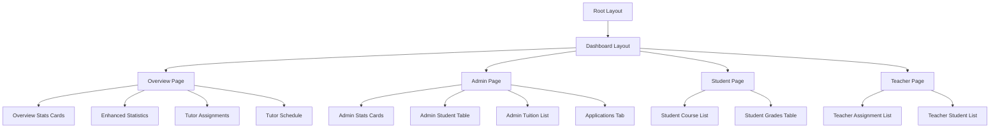
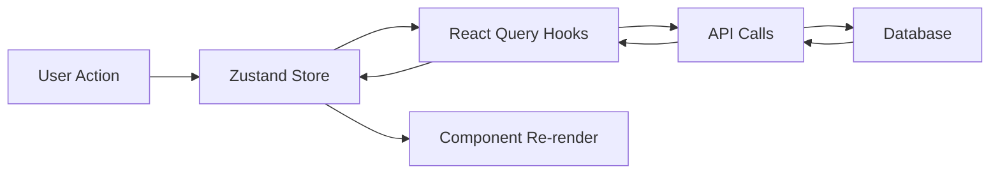

# Frontend Architecture Documentation

## Table of Contents
1. [Overview](#overview)
2. [Next.js App Router Implementation](#nextjs-app-router-implementation)
3. [Routing Patterns](#routing-patterns)
4. [Layout Structure](#layout-structure)
5. [Server vs Client Components](#server-vs-client-components)
6. [Component Architecture](#component-architecture)
7. [State Management](#state-management)
8. [Data Fetching](#data-fetching)
9. [Performance Optimization](#performance-optimization)
10. [Styling Strategy](#styling-strategy)

## Overview

The frontend is built with Next.js 16 using the App Router, React 19, TypeScript, and TailwindCSS. The architecture follows modern React patterns with a focus on performance, type safety, and developer experience.

### Key Frontend Technologies
- **Framework**: Next.js 16 (App Router)
- **UI Library**: React 19
- **Language**: TypeScript 5.9.3
- **Styling**: TailwindCSS 3.4.17
- **State Management**: Zustand 5.0.14
- **Data Fetching**: TanStack React Query 5.0.0
- **Animations**: Framer Motion 12.40.0
- **Charts**: Recharts 3.8.1
- **Icons**: Lucide React 1.17.0
- **Forms**: Zod 4.4.3

## Next.js App Router Implementation

### App Router Structure
The application uses Next.js App Router with the following structure:

```
app/
├── layout.tsx              # Root layout
├── page.tsx                # Landing page
├── login/                  # Login page
│   └── page.tsx
├── register/               # Registration page
│   └── page.tsx
├── dashboard/              # Dashboard routes
│   ├── layout.tsx          # Dashboard layout
│   ├── overview/          # Overview dashboard
│   ├── admin/             # Admin dashboard
│   ├── student/           # Student dashboard
│   ├── teachers/          # Teacher dashboard
│   ├── profile/           # Profile page
│   └── settings/          # Settings page
└── api/                   # API routes
```

### Root Layout (`app/layout.tsx`)
The root layout provides:
- HTML structure with metadata
- QueryProvider for React Query
- PWAInstall component for PWA functionality
- Global CSS imports
- SEO optimization with structured data

```typescript
export default function RootLayout({ children }: { children: React.ReactNode }) {
  return (
    <html lang="en">
      <head>
        {/* Metadata and structured data */}
      </head>
      <body>
        <QueryProvider>
          <PWAInstall />
          <main>{children}</main>
        </QueryProvider>
      </body>
    </html>
  );
}
```

### Dashboard Layout (`app/dashboard/layout.tsx`)
The dashboard layout provides:
- Role-based navigation
- Authentication check
- Mobile-responsive sidebar
- Fixed header for tabs
- Scrollable content area
- User information display

## Routing Patterns

### Public Routes
- `/` - Landing page
- `/login` - Login page
- `/register` - Registration page

### Protected Routes
All dashboard routes require authentication:
- `/dashboard/overview` - Overview dashboard (all roles)
- `/dashboard/admin` - Admin dashboard (admin only)
- `/dashboard/student` - Student dashboard (students)
- `/dashboard/teachers` - Teacher dashboard (teachers/admins)
- `/dashboard/profile` - User profile (authenticated)
- `/dashboard/settings` - User settings (authenticated)

### Route Protection
Route protection is handled by:
1. Authentication middleware (sets headers)
2. Client-side auth store check
3. Role-based navigation items
4. Automatic redirect to login if not authenticated

### Navigation Patterns
```typescript
// Role-based navigation items
const getNavItems = () => {
  const role = user?.role?.name;
  
  const baseItems = [
    { id: 'overview', path: '/dashboard/overview' },
    { id: 'profile', path: '/dashboard/profile' },
    { id: 'settings', path: '/dashboard/settings' }
  ];

  // Role-specific items
  if (role === 'admin') {
    baseItems.push({ id: 'admin', path: '/dashboard/admin' });
  }
  
  if (role === 'teacher' || role === 'admin') {
    baseItems.push({ id: 'teacher-dashboard', path: '/dashboard/teachers' });
  }

  return [...baseItems, { id: 'student-dashboard', path: '/dashboard/student' }];
};
```

## Layout Structure

### Nested Layouts
The application uses nested layouts for code organization:

1. **Root Layout** (`app/layout.tsx`)
   - Global providers
   - HTML structure
   - Metadata

2. **Dashboard Layout** (`app/dashboard/layout.tsx`)
   - Sidebar navigation
   - Authentication check
   - Role-based routing
   - Mobile responsiveness

### Layout Composition
```typescript
// Root layout wraps everything
<RootLayout>
  {/* Public routes */}
  <Page />
  <Login />
  <Register />
  
  {/* Protected dashboard routes */}
  <DashboardLayout>
    <Overview />
    <Admin />
    <Student />
  </DashboardLayout>
</RootLayout>
```

### Layout Features
- **Responsive Design**: Mobile-first approach with sidebar that slides on mobile
- **Role-Based Navigation**: Navigation items filtered by user role
- **Fixed Header**: Tabs container fixed at top for quick navigation
- **Scrollable Content**: Main content area with independent scrolling
- **Portal Rendering**: Tabs rendered in fixed header using React Portal

## Server vs Client Components

### Client Components Strategy
Most components are client components (`'use client'`) due to:
- Interactive features (forms, navigation, state)
- Authentication state management
- Real-time data updates
- User interactions

### Server Components Usage
Server components are used where applicable:
- Static content rendering
- SEO-critical pages
- Initial data loading (where possible)

### Component Marking
```typescript
'use client'; // For interactive components
import { useState } from 'react';

export default function InteractiveComponent() {
  const [state, setState] = useState();
  // Interactive logic
}
```

### Performance Considerations
- Client components bundle JavaScript to the browser
- Server components render on the server (better performance)
- Use server components for static content where possible
- Minimize client component bundle size

## Component Architecture

### Component Organization
```
components/
├── admin/              # Admin-specific components
├── cleaning/           # Cleaning system components
├── overview/           # Dashboard overview components
├── shared/             # Shared/reusable components
├── student/            # Student-specific components
├── teacher/            # Teacher-specific components
└── ui/                 # UI component library
```

### Component Hierarchy


### Reusable Components

#### Shared Components
- `DashboardTabs` - Tab navigation for dashboards
- `LoadingState` - Loading skeleton components
- `ErrorState` - Error display component
- `GradeBadge` - Grade display badge
- `StatsCard` - Statistics card component
- `StatsGrid` - Statistics grid layout
- `SharedGradesTab` - Shared grades display

#### UI Components
- `GradeFilterBar` - Grade filtering interface
- `WeekSelector` - Week selection (unused)
- `ReligionSelector` - Religion selection (unused)
- `TuitionInput` - Tuition input (unused)
- `CourseForm` - Course form (unused)
- `GradeAssignmentCard` - Grade assignment card

### Component Patterns

#### Container/Presentational Pattern
```typescript
// Container component (handles logic)
export default function AdminDashboard() {
  const { data, isLoading } = useAdminStudents();
  // Business logic
  return <AdminStudentTable students={data} />;
}

// Presentational component (handles display)
export default function AdminStudentTable({ students }) {
  // Display logic only
}
```

#### Composition Pattern
```typescript
// Complex components composed from simpler ones
export default function OverviewStatsCards({ stats }) {
  return (
    <StatsGrid stats={stats} columns={4}>
      {stats.map(stat => (
        <StatsCard key={stat.id} {...stat} />
      ))}
    </StatsGrid>
  );
}
```

## State Management

### Zustand Store (`stores/authStore.ts`)
Client-side authentication state management:

```typescript
interface AuthState {
  user: User | null;
  isAuthenticated: boolean;
  isLoading: boolean;
  setAuth: (user: User) => void;
  clearAuth: () => void;
  login: (email: string) => Promise<void>;
  logout: () => Promise<void>;
  fetchUser: () => Promise<void>;
}
```

#### State Management Strategy
- **Authentication**: Zustand store (client state)
- **Server Data**: React Query (server state)
- **UI State**: React useState (local component state)
- **Form State**: React useState with Zod validation

#### Data Flow


### State Synchronization
- Auth store synchronized with JWT cookie
- React Query cache invalidated on mutations
- Local state isolated to components
- No global state pollution

## Data Fetching

### React Query Implementation
Server state management with TanStack React Query:

```typescript
// Query hooks in hooks/queries/
export const useAdminStudents = (params) => {
  return useQuery({
    queryKey: ['admin', 'students', params],
    queryFn: () => adminApi.getStudents(params),
    staleTime: 5 * 60 * 1000, // 5 minutes
  });
};
```

### Query Key Hierarchy
```typescript
const adminKeys = {
  all: ['admin'] as const,
  students: (params) => [...adminKeys.all, 'students', params] as const,
  student: (id) => [...adminKeys.all, 'student', id] as const,
  gpaDistribution: () => [...adminKeys.all, 'gpaDistribution'] as const,
};
```

### Data Fetching Patterns

#### Automatic Refetching
```typescript
useQuery({
  queryKey: ['overview'],
  queryFn: fetchOverviewData,
  staleTime: 30 * 1000,        // 30 seconds
  refetchInterval: 60 * 1000,  // Auto-refresh every minute
});
```

#### Optimistic Updates
```typescript
useMutation({
  mutationFn: updateTuitionStatus,
  onMutate: async (newData) => {
    // Cancel outgoing refetches
    await queryClient.cancelQueries({ queryKey: ['students'] });
    // Snapshot previous value
    const previousData = queryClient.getQueryData(['students']);
    // Optimistically update
    queryClient.setQueryData(['students'], newData);
    return { previousData };
  },
  onError: (err, newData, context) => {
    // Rollback on error
    queryClient.setQueryData(['students'], context.previousData);
  },
  onSettled: () => {
    // Refetch after success/failure
    queryClient.invalidateQueries({ queryKey: ['students'] });
  },
});
```

### API Client Configuration
Axios instance configured in `lib/axios.ts`:

```typescript
const axiosInstance = axios.create({
  baseURL: process.env.NEXT_PUBLIC_API_URL || '',
  withCredentials: true, // Sends cookies
  headers: { 'Content-Type': 'application/json' },
});
```

### Error Handling
```typescript
try {
  const response = await axios.get('/api/endpoint');
  return response.data;
} catch (error) {
  console.error('API Error:', error);
  throw error;
}
```

## Performance Optimization

### Code Splitting
- Automatic code splitting by Next.js App Router
- Dynamic imports for large components
- Route-based splitting

### Memoization
```typescript
// React.memo for expensive components
export default React.memo(function ExpensiveComponent({ data }) {
  // Component logic
});

// useMemo for expensive calculations
const calculatedValue = useMemo(() => {
  return expensiveCalculation(data);
}, [data]);

// useCallback for stable function references
const handleClick = useCallback(() => {
  // Handler logic
}, [dependency]);
```

### Image Optimization
```typescript
// Next.js Image component
<Image
  src="/freedom.png"
  alt="Freedom City Tech Center"
  width={512}
  height={512}
  priority // For above-the-fold images
/>
```

### Bundle Optimization
- Turbopack for faster builds
- Package import optimization
- Tree shaking
- Minification

### Caching Strategy
- React Query with stale-time configuration
- HTTP caching headers
- Service worker for PWA caching
- CDN for static assets

## Styling Strategy

### TailwindCSS Configuration
TailwindCSS with custom configuration:

```javascript
// tailwind.config.js
module.exports = {
  content: [
    './app/**/*.{js,ts,jsx,tsx,mdx}',
    './components/**/*.{js,ts,jsx,tsx,mdx}',
  ],
  theme: {
    extend: {
      colors: {
        // Custom color palette
      },
    },
  },
  plugins: [
    require('@tailwindcss/forms'),
  ],
};
```

### Styling Patterns

#### Utility-First Approach
```typescript
<div className="flex items-center gap-4 px-4 py-3 rounded-lg bg-white/10 hover:bg-white/20 transition-colors">
  {/* Content */}
</div>
```

#### Responsive Design
```typescript
<div className="grid grid-cols-1 md:grid-cols-2 lg:grid-cols-4 gap-6">
  {/* Responsive grid */}
</div>
```

#### Dark Mode Support
```typescript
<div className="bg-white dark:bg-gray-900 text-gray-900 dark:text-white">
  {/* Dark mode compatible */}
</div>
```

### Component Styling
- Consistent spacing scale
- Color palette for theming
- Typography scale
- Responsive breakpoints
- Animation utilities

## Animation Strategy

### Framer Motion Usage
```typescript
import { motion } from 'framer-motion';

<motion.div
  initial={{ opacity: 0, y: 20 }}
  animate={{ opacity: 1, y: 0 }}
  transition={{ duration: 0.6 }}
>
  {/* Animated content */}
</motion.div>
```

### Animation Patterns
- Page transitions
- Component entrance animations
- Hover effects
- Loading states
- Success/error feedback

## Form Handling

### Validation with Zod
```typescript
import { z } from 'zod';

const registerSchema = z.object({
  firstName: z.string().min(2).max(50),
  email: z.string().email(),
  password: z.string().min(6).regex(/^(?=.*[A-Za-z])(?=.*\d)/),
});

// Usage
const result = registerSchema.safeParse(formData);
if (!result.success) {
  // Handle validation errors
}
```

### Form Patterns
- Client-side validation with Zod
- Server-side validation in API routes
- Error display and user feedback
- Loading states during submission

## Accessibility

### ARIA Attributes
```typescript
<button
  aria-label="Close menu"
  aria-expanded={isOpen}
  onClick={toggleMenu}
>
  {/* Button content */}
</button>
```

### Keyboard Navigation
- Tab order management
- Keyboard shortcuts
- Focus management
- Screen reader support

### Responsive Design
- Mobile-first approach
- Touch-friendly interfaces
- Readable text sizes
- Sufficient color contrast

## Testing Strategy

### Component Testing
- Unit tests for utility functions
- Component integration tests
- E2E tests for critical flows

### Testing Tools
- Jest for unit tests
- React Testing Library for component tests
- Playwright for E2E tests

## Build and Deployment

### Build Process
```bash
# Development
npm run dev

# Production build
npm run build

# Start production server
npm start
```

### Build Optimization
- Turbopack for faster builds
- Automatic code splitting
- Tree shaking
- Minification
- Image optimization

### Environment Variables
- `DATABASE_URL`: MongoDB connection string
- `JWT_SECRET`: JWT signing secret
- `NEXT_PUBLIC_API_URL`: Public API URL
- `NODE_ENV`: Environment (development/production)
