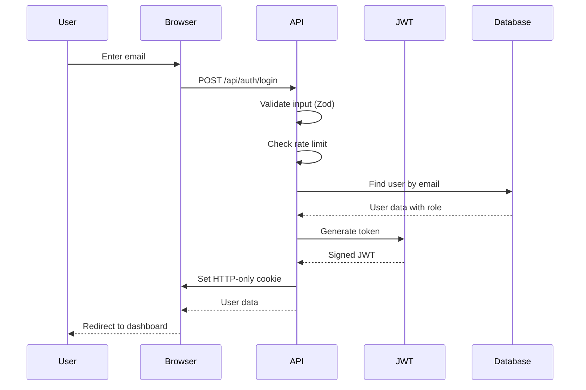
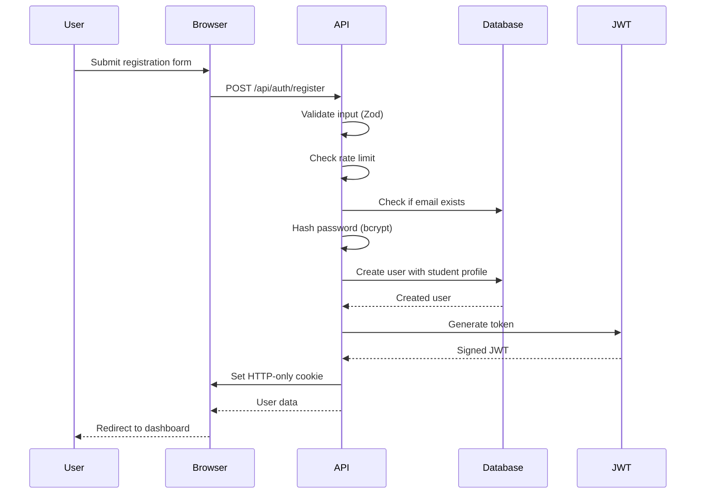
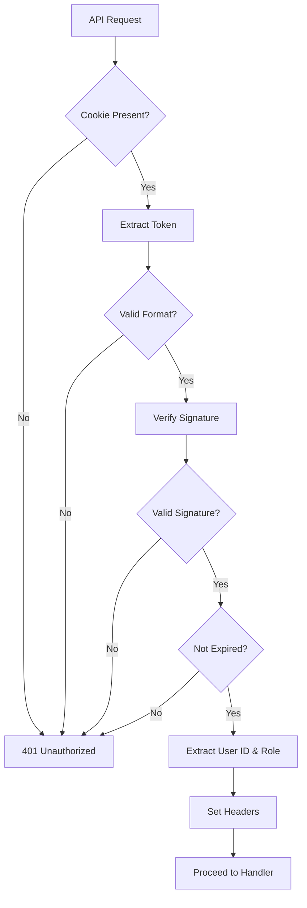

# Security Architecture Documentation

## Table of Contents
1. [Overview](#overview)
2. [Authentication Flow](#authentication-flow)
3. [Authorization & RBAC](#authorization--rbac)
4. [JWT Token Management](#jwt-token-management)
5. [Password Security](#password-security)
6. [API Security](#api-security)
7. [Data Protection](#data-protection)
8. [Rate Limiting](#rate-limiting)
9. [Input Validation](#input-validation)
10. [Security Headers](#security-headers)
11. [Environment Variables](#environment-variables)
12. [Security Best Practices](#security-best-practices)

## Overview

The application implements a comprehensive security architecture focusing on authentication, authorization, data protection, and secure communication. Security is implemented at multiple layers to provide defense in depth.

### Security Layers
1. **Authentication Layer**: JWT-based authentication with HTTP-only cookies
2. **Authorization Layer**: Role-based access control (RBAC)
3. **API Security Layer**: Input validation, rate limiting, CORS
4. **Data Layer**: Encrypted passwords, secure database connections
5. **Network Layer**: HTTPS, security headers, CORS policies

### Security Principles
- **Defense in Depth**: Multiple security layers
- **Least Privilege**: Users have minimum required permissions
- **Secure by Default**: Security-first configuration
- **Zero Trust**: Verify every request
- **Fail Secure**: Default to secure state on errors

## Authentication Flow

### Login Process


### Registration Process


### Authentication Components

#### JWT Token Generation
```typescript
// lib/jwt-edge.ts (Edge-compatible)
export async function generateTokenEdge(payload: { userId: string; role: string }) {
  const secret = new TextEncoder().encode(process.env.JWT_SECRET);
  const token = await new SignJWT(payload)
    .setProtectedHeader({ alg: 'HS256' })
    .setIssuedAt()
    .setExpirationTime('7d')
    .sign(secret);
  return token;
}
```

#### Token Verification
```typescript
// lib/jwt.ts (Node.js compatible)
export function verifyToken(token: string) {
  try {
    const decoded = jwt.verify(token, SECRET_KEY, { algorithms: ['HS256'] });
    return decoded as { userId: string; role?: string };
  } catch (error) {
    console.error('JWT verification failed:', error);
    return null;
  }
}
```

#### Cookie Configuration
```typescript
response.cookies.set('token', token, {
  httpOnly: true,              // Prevent XSS
  secure: process.env.NODE_ENV === 'production', // HTTPS only in production
  sameSite: 'lax',             // CSRF protection
  maxAge: 60 * 60 * 24 * 7,    // 7 days
  path: '/',                   // Available on all routes
});
```

## Authorization & RBAC

### Role-Based Access Control
The application uses a role-based access control system with three primary roles:

#### Role Definitions
```typescript
enum Role {
  ADMIN = 'admin',
  TEACHER = 'teacher',
  STUDENT = 'student'
}
```

#### Role Permissions
```typescript
// Admin Role
{
  name: 'admin',
  permissions: [
    'read',
    'write',
    'delete',
    'manage_users',
    'manage_roles',
    'view_all_data'
  ]
}

// Teacher Role
{
  name: 'teacher',
  permissions: [
    'read',
    'write',
    'manage_students',
    'assign_grades',
    'view_student_data'
  ]
}

// Student Role
{
  name: 'student',
  permissions: [
    'read',
    'submit_assignments',
    'view_grades',
    'view_own_data'
  ]
}
```

### Authorization Helper Functions
```typescript
// lib/auth-helper.ts

export async function requireAuth(request: NextRequest) {
  const user = await getAuthenticatedUser(request);
  if (!user) {
    return NextResponse.json({ error: 'Unauthorized' }, { status: 401 });
  }
  return { user };
}

export async function requireRole(request: NextRequest, requiredRoles: string[]) {
  const authResult = await requireAuth(request);
  if (authResult instanceof NextResponse) {
    return authResult;
  }
  
  const { user } = authResult;
  if (!hasRole(user, requiredRoles)) {
    return NextResponse.json({ error: 'Forbidden' }, { status: 403 });
  }
  
  return { user };
}

export function hasRole(user: any, requiredRoles: string[]): boolean {
  if (!user?.role?.name) return false;
  return requiredRoles.includes(user.role.name);
}
```

### Route Protection Patterns

#### Admin-Only Routes
```typescript
export async function GET(request: NextRequest) {
  const authResult = await requireRole(request, ['admin']);
  if (authResult instanceof NextResponse) {
    return authResult;
  }
  
  // Admin-only logic
}
```

#### Multi-Role Routes
```typescript
export async function GET(request: NextRequest) {
  const authResult = await requireRole(request, ['admin', 'teacher']);
  if (authResult instanceof NextResponse) {
    return authResult;
  }
  
  // Admin or teacher logic
}
```

#### Authenticated Routes
```typescript
export async function GET(request: NextRequest) {
  const authResult = await requireAuth(request);
  if (authResult instanceof NextResponse) {
    return authResult;
  }
  
  // Any authenticated user
}
```

## JWT Token Management

### Token Structure
```typescript
interface JWTPayload {
  userId: string;
  role: string;
  iat: number;  // Issued at
  exp: number;  // Expiration time
}
```

### Token Lifecycle
1. **Generation**: Created on successful login/registration
2. **Storage**: Stored in HTTP-only cookie
3. **Verification**: Verified on each API request
4. **Refresh**: No refresh tokens (7-day expiry)
5. **Revocation**: Logout clears cookie

### Token Security Measures
- **HTTP-only**: Prevents JavaScript access (XSS protection)
- **Secure**: HTTPS only in production
- **SameSite**: CSRF protection
- **Short Expiry**: 7-day token lifetime
- **Strong Secret**: Environment variable with minimum entropy
- **Algorithm**: HS256 with proper secret management

### Token Validation Flow


## Password Security

### Password Hashing
```typescript
import bcrypt from 'bcryptjs';

// Hash password with salt rounds
const hashedPassword = await bcrypt.hash(password, 10);

// Verify password
const isValid = await bcrypt.compare(plainPassword, hashedPassword);
```

### Password Requirements
```typescript
const passwordSchema = z.string()
  .min(6, 'Password must be at least 6 characters long')
  .regex(
    /^(?=.*[A-Za-z])(?=.*\d)/,
    'Password must contain at least 1 letter and 1 number'
  );
```

### Password Security Measures
- **Hashing**: bcrypt with 10 salt rounds
- **No Storage**: Plain passwords never stored
- **Validation**: Client and server-side validation
- **Complexity**: Minimum 6 characters, letter + number requirement
- **No Reuse**: Not implemented (could be added)

## API Security

### Input Validation
All API endpoints use Zod for input validation:

```typescript
import { z } from 'zod';

const loginSchema = z.object({
  email: z.string().email().transform(val => val.toLowerCase()),
});

// Usage
const validationResult = loginSchema.safeParse(body);
if (!validationResult.success) {
  return NextResponse.json(
    { success: false, message: validationResult.error.issues[0].message },
    { status: 400 }
  );
}
```

### Rate Limiting
```typescript
// lib/rateLimit.ts
const rateLimitStore = new Map<string, { count: number; resetTime: number }>();

export function rateLimit(identifier: string, maxRequests: number, windowMs: number) {
  const now = Date.now();
  const record = rateLimitStore.get(identifier);
  
  if (!record || now > record.resetTime) {
    rateLimitStore.set(identifier, { count: 1, resetTime: now + windowMs });
    return { success: true };
  }
  
  if (record.count >= maxRequests) {
    return { success: false, resetTime: record.resetTime };
  }
  
  record.count++;
  return { success: true };
}
```

### Rate Limiting Strategy
- **Authentication Endpoints**: 5 requests per minute per IP/email
- **General Endpoints**: No rate limiting (authentication required)
- **Identifier**: IP address + email for auth endpoints
- **Storage**: In-memory (consider Redis for production)

### CORS Configuration
```javascript
// next.config.js
module.exports = {
  async headers() {
    return [
      {
        source: '/:path*',
        headers: [
          { key: 'Access-Control-Allow-Credentials', value: 'true' },
          { key: 'Access-Control-Allow-Origin', value: '*' },
          { key: 'Access-Control-Allow-Methods', value: 'GET,OPTIONS,PATCH,DELETE,POST,PUT' },
        ],
      },
    ];
  },
};
```

## Data Protection

### Sensitive Data Handling
- **Passwords**: Hashed with bcrypt, never logged
- **JWT Tokens**: HTTP-only cookies, never in localStorage
- **User Data**: Role-based access control
- **PII**: Phone numbers optional, email as unique identifier

### Database Security
- **Connection String**: Environment variable
- **ORM**: Prisma (parameterized queries, SQL injection prevention)
- **Indexes**: Strategic indexing for performance
- **Backup**: Regular backups recommended

### Data Encryption
- **Passwords**: bcrypt hashing (one-way)
- **JWT**: HS256 signing
- **HTTPS**: TLS encryption in production
- **Database**: MongoDB Atlas encryption at rest

## Rate Limiting

### Implementation Details
```typescript
// lib/rateLimit.ts
export function getIdentifier(request: Request, email?: string): string {
  const ip = request.headers.get('x-forwarded-for') || 
            request.headers.get('x-real-ip') || 
            'unknown';
  return `${ip}:${email || 'no-email'}`;
}
```

### Rate Limiting by Endpoint
- **POST /api/auth/login**: 5 requests/minute
- **POST /api/auth/register**: 5 requests/minute
- **Other endpoints**: No rate limiting (requires auth)

### Rate Limit Response
```json
{
  "success": false,
  "message": "Too many login attempts. Please try again later.",
  "resetTime": "2024-01-15T10:05:00Z"
}
```

## Input Validation

### Validation Layers
1. **Client-side**: Zod validation in forms
2. **Server-side**: Zod validation in API routes
3. **TypeScript**: Compile-time type checking
4. **Database**: Schema constraints

### Validation Schemas
```typescript
// lib/validations/auth.ts
export const registerSchema = z.object({
  firstName: z.string().min(2).max(50).regex(/^[a-zA-Z\s\-']+$/),
  lastName: z.string().min(2).max(50).regex(/^[a-zA-Z\s\-']+$/),
  email: z.string().email().transform(val => val.toLowerCase()),
  password: z.string().min(6).regex(/^(?=.*[A-Za-z])(?=.*\d)/),
  phoneNumber: z.string().regex(/^[\d\s\-\+\(\)]+$/),
});
```

### SQL Injection Prevention
- **Prisma ORM**: Parameterized queries by default
- **No Raw SQL**: All queries through Prisma
- **Input Validation**: All inputs validated before database operations

### XSS Prevention
- **React**: Automatic escaping by default
- **HTTP-only Cookies**: Prevent token theft
- **Content Security Policy**: Can be added
- **Input Sanitization**: Zod validation

## Security Headers

### Next.js Security Configuration
```javascript
// next.config.js
module.exports = {
  poweredByHeader: false,  // Remove X-Powered-By header
  compress: true,         // Enable gzip compression
  productionBrowserSourceMaps: false,  // Disable source maps in production
};
```

### Recommended Security Headers
```javascript
// Add to next.config.js
module.exports = {
  async headers() {
    return [
      {
        source: '/:path*',
        headers: [
          { key: 'X-DNS-Prefetch-Control', value: 'on' },
          { key: 'Strict-Transport-Security', value: 'max-age=63072000; includeSubDomains; preload' },
          { key: 'X-Frame-Options', value: 'SAMEORIGIN' },
          { key: 'X-Content-Type-Options', value: 'nosniff' },
          { key: 'X-XSS-Protection', value: '1; mode=block' },
          { key: 'Referrer-Policy', value: 'strict-origin-when-cross-origin' },
        ],
      },
    ];
  },
};
```

## Environment Variables

### Required Environment Variables
```env
# Database
DATABASE_URL=mongodb+srv://...

# JWT Secret (minimum 32 characters, random)
JWT_SECRET=your-super-secret-jwt-key-min-32-chars

# API URL (optional, defaults to current origin)
NEXT_PUBLIC_API_URL=http://localhost:3000

# Node Environment
NODE_ENV=development
```

### Environment Variable Security
- **Never Commit**: Never commit .env files
- **Strong Secrets**: Use cryptographically strong secrets
- **Rotation**: Regular secret rotation recommended
- **Access**: Limit access to environment variables
- **Backup**: Secure backup of environment configuration

## Security Best Practices

### Development Security
- **No Hardcoded Secrets**: Use environment variables
- **Secure Dependencies**: Regular dependency updates
- **Code Review**: Security-focused code reviews
- **Testing**: Security testing in CI/CD
- **Monitoring**: Security event monitoring

### Production Security
- **HTTPS**: Always use HTTPS in production
- **Strong Secrets**: Use strong, randomly generated secrets
- **Regular Updates**: Keep dependencies updated
- **Monitoring**: Monitor for security events
- **Backup**: Regular, secure backups

### User Security
- **Password Requirements**: Enforce strong passwords
- **Session Management**: Secure session handling
- **Logout**: Proper logout implementation
- **Password Reset**: Implement password reset (not yet implemented)
- **2FA**: Consider two-factor authentication

### API Security
- **Authentication**: All protected endpoints require auth
- **Authorization**: Role-based access control
- **Input Validation**: Validate all inputs
- **Rate Limiting**: Prevent abuse
- **Error Handling**: Don't leak sensitive information

### Database Security
- **Connection Security**: Use connection strings, not credentials in code
- **Access Control**: Least privilege database access
- **Encryption**: Encryption at rest and in transit
- **Backup**: Regular, secure backups
- **Monitoring**: Monitor for suspicious activity

## Security Monitoring

### Logging
```typescript
// Security event logging
console.log('✅ Login successful for email:', email, 'userId:', user.id, 'role:', userRole);
console.error('❌ Login failed for email:', email, 'reason': 'User not found');
```

### Monitoring Recommendations
- **Failed Login Attempts**: Monitor for brute force attacks
- **Rate Limit Violations**: Monitor for abuse
- **Unauthorized Access**: Monitor for 401/403 errors
- **Database Errors**: Monitor for injection attempts
- **Performance**: Monitor for DoS attacks

## Security Checklist

### Before Deployment
- [ ] All environment variables set
- [ ] JWT_SECRET is strong and random
- [ ] HTTPS enabled
- [ ] Security headers configured
- [ ] Rate limiting enabled
- [ ] Input validation on all endpoints
- [ ] Password hashing implemented
- [ ] HTTP-only cookies configured
- [ ] CORS properly configured
- [ ] Database access restricted
- [ ] Dependencies updated
- [ ] Security testing completed

### Regular Maintenance
- [ ] Update dependencies monthly
- [ ] Rotate JWT secrets quarterly
- [ ] Review access logs weekly
- [ ] Security audit annually
- [ ] Penetration testing periodically
- [ ] Backup verification regularly

## Incident Response

### Security Incident Response Plan
1. **Detection**: Monitor for security events
2. **Assessment**: Evaluate severity and impact
3. **Containment**: Isolate affected systems
4. **Eradication**: Remove threat
5. **Recovery**: Restore from clean backups
6. **Lessons Learned**: Document and improve

### Emergency Contacts
- Security Team: [Contact Information]
- Database Admin: [Contact Information]
- DevOps Team: [Contact Information]
- Legal Team: [Contact Information]

## Compliance Considerations

### Data Privacy
- **GDPR**: User data handling and consent
- **CCPA**: California privacy compliance
- **Local Laws**: Uganda data protection laws

### Data Retention
- **User Data**: Retention policy needed
- **Logs**: Log retention policy needed
- **Backups**: Backup retention policy needed

### User Rights
- **Access**: Users can access their data
- **Deletion**: Users can request deletion
- **Correction**: Users can correct their data
- **Portability**: Users can export their data
